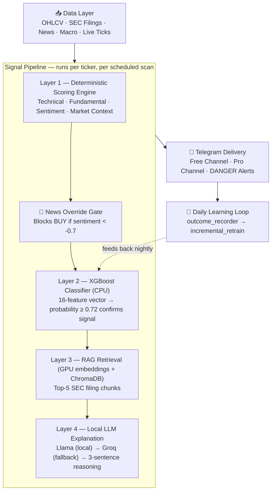

<div align="center">

# ⚡ SignalForge

### Autonomous US Equity Signal Intelligence Engine

*Precision signals, built from 20 years of market data, learning every single trading day.*


</div>

---

## 📊 At a Glance

| | | |
|---|---|---|
| **Universe** | 800 US equities | S&P 500 + Russell 300 extension |
| **Training History** | 20 years | 2004 – 2024, includes 2008 crash + COVID |
| **Validation** | 15-window walk-forward | Survivorship-bias corrected |
| **Hardware** | RTX 3050 Ti · 4GB VRAM | Local GPU inference, no cloud ML cost |
| **Delivery** | Telegram | Free + Pro tier channels |
| **Monthly Infra Cost** | ~$5 | Single VPS, everything else free-tier |

---

## 🧭 What This Is — and What It Deliberately Is Not

SignalForge is a quantitative signal intelligence system covering 800 US-listed equities. It fuses a deterministic scoring engine, an XGBoost classifier trained on two decades of market data, a retrieval-augmented reasoning layer over SEC filings, and a locally-hosted LLM explanation layer — delivered autonomously to subscribers over Telegram.

It is built around a small set of non-negotiable engineering invariants:

> 🚫 **No auto-execution.** Alpaca Markets is used for live price data only — the system never places an order.
>
> 🚫 **No mobile app.** Delivery is Telegram-only by design — zero app-store friction, zero maintenance surface.
>
> 🧠 **The LLM never decides.** XGBoost and the deterministic scoring engine make every BUY / SELL / HOLD call. The local LLM (with a remote fallback) only writes the human-readable explanation **after** the decision is already made.
>
> ⚙️ **GPU is reserved for NLP.** FinBERT and sentence-embedding inference run on CUDA. The XGBoost classifier runs on CPU — gradient-boosted trees gain nothing from GPU acceleration at this feature scale.

---

## 🏗️ Architecture



---

## 🧰 Tech Stack

| Layer | Technology |
|---|---|
| **Backend** | FastAPI · Python 3.11 |
| **ML Core** | XGBoost · scikit-learn · joblib *(CPU)* |
| **NLP / Embeddings** | FinBERT · sentence-transformers (`all-MiniLM-L6-v2`) *(CUDA)* |
| **Sentiment Fallback** | VADER — pre-2013 coverage gap |
| **Vector Store** | ChromaDB *(local, persistent)* |
| **Relational Store** | SQLite via SQLAlchemy ORM |
| **Explanation Engine** | Local quantized Llama *(primary)* → Groq Llama 3.1 70B *(fallback)* |
| **Live Market Data** | Alpaca Markets WebSocket — **data only** |
| **Historical Data** | yfinance · SEC EDGAR · FRED · GDELT-class news sources |
| **Delivery** | python-telegram-bot |
| **Scheduling** | APScheduler *(America/New_York)* |
| **Indicators** | pandas-ta |
| **Logging** | loguru — rotating, 7-day retention |
| **Resilience** | tenacity — exponential backoff on all external calls |
| **Hosting** | Hetzner VPS · PM2 process manager |

---

## 📁 Repository Structure

```
signalforge/
├── pipeline/           # Data ingestion — OHLCV, SEC, news, macro, live feed
├── nlp/                # GPU inference — FinBERT scoring, embeddings
├── signals/            # Deterministic scoring + signal generation
├── ml/                 # XGBoost training, walk-forward, daily learning loop
├── rag/                # SEC filing chunking, ChromaDB store + retrieval
├── llm/                # local_explainer.py (primary) + groq_explainer.py (fallback)
├── delivery/           # Telegram bot, channel routing, scheduler
├── api/                # FastAPI app + signal / health / webhook routes
├── db/                 # SQLAlchemy models + schema
├── chroma_db/          # Vector store (gitignored)
├── logs/                # Rotating logs (gitignored)
├── config.py           # Centralized constants — no hardcoded secrets
└── requirements.txt
```

> Data directories, the trained model artifact, the vector store, and `.env` are intentionally excluded from version control — see `.gitignore`. This repository documents the architecture and engineering approach; proprietary trained weights and scoring thresholds are withheld.

---

## ✅ Validation Methodology

Model quality is established through **walk-forward validation** — not a single train/test split — across 15 rolling windows spanning 2004–2024, explicitly stress-tested against the 2008 financial crisis and the 2020 COVID crash.

| Window | Train Period | Test Year | Stress Event |
|---|---|---|---|
| 04 | 2007 – 2011 | 2012 | — |
| **05** | **2008 – 2012** | **2013** | **🔴 2008 crisis in training window** |
| 11 | 2014 – 2018 | 2019 | — |
| **12** | **2015 – 2019** | **2020** | **🔴 COVID crash — test year** |
| 15 | 2018 – 2022 | 2023 | — |

*Average accuracy and AUC across all 15 windows: see `walk_forward_results` table — figures are continuously updated as the model incrementally retrains on live outcomes.*

**Survivorship bias correction:** every window trains only on tickers that were actual constituents of the S&P 500 during that historical period — never on today's index composition projected backward.

---

## ⏱️ Operational Schedule

| Time (ET) | Job | Output |
|---|---|---|
| 09:00 | Pre-market scan | LONG TERM signals → Pro channel (top 10) + Free channel (1) |
| 11:00 | Intraday scan | INTRADAY signals → Pro channel only |
| 14:00 | Intraday scan | INTRADAY signals → Pro channel only |
| *every 30 min, market hours* | Live news refresh | Top-50 volume tickers, new sentiment ingested |
| 16:15 | Post-market scan | LONG TERM EOD signals → Pro + Free |
| 16:30 | Outcome recorder | Verifies prior signals against real price movement |
| 23:00 | Incremental retrain | XGBoost updates on new verified outcomes (min. 20 required) |

**Weekly / quarterly:** full model retrain on the expanded dataset · RAG index refresh as new SEC filings are published.

---

## 🚀 Quick Start

```bash
# Clone and enter the repository
git clone https://github.com/christapher25/SignalForge.git
cd SignalForge

# Create and activate a virtual environment
python -m venv venv
venv\Scripts\activate          # Windows
# source venv/bin/activate     # macOS / Linux

# Install dependencies
pip install -r requirements.txt

# Configure environment
cp .env.example .env           # then populate with your own API keys
```

```bash
# Verify environment + CUDA availability
python verify_env.py

# Initialize the database schema
python db/database.py
```

### 🗓️ Weekday Operations *(Market Days)*

```bash
python rag/chunker.py          # Process any same-day 8-K filings into chunks
python run_news.py             # Live news ingestion + FinBERT scoring daemon
python rag/chroma_sync.py      # Sync refreshed chunks into ChromaDB
python pipeline/rag_updater.py # Reconcile RAG store with latest filings
python pipeline/alpaca_feed.py # Live tick WebSocket — market hours only
uvicorn api.main:app --reload  # FastAPI signal + webhook endpoints
python delivery/scheduler.py   # Telegram delivery + daily learning loop
python run_bot.py              # Telegram bot — subscriber-facing layer
```

### 🗓️ Weekend Operations *(Maintenance Cycle)*

```bash
python pipeline/fetch_sec.py   # Pull newly published 10-K / 10-Q filings
python pipeline/rag_updater.py # Reconcile RAG store with latest filings
python rag/chunker.py          # Chunk new filings into embedding-ready segments
python rag/chroma_sync.py      # Sync new chunks into ChromaDB
```

> Full task-by-task build documentation, including the data pipeline bootstrap sequence and model training steps, is maintained internally.

---

## 🎟️ Access Tiers

| | Free | Pro — $19/mo |
|---|---|---|
| Signals per day | 1 (EOD) | All scheduled sessions |
| Entry / Target / Stop Loss | ❌ | ✅ |
| AI Reasoning | ❌ | ✅ |
| DANGER Alerts | ❌ | ✅ |
| Channel | Public | Private |

---

## 🗺️ Roadmap

| Phase | Timeline | Focus |
|---|---|---|
| **1 — Launch** | *Current* | Autonomous 24/7 operation, zero manual intervention |
| **2 — Intelligence** | +6–12mo | Regime-aware models, meta-labeling, probability calibration, subscriber dashboard |
| **3 — Scale** | +24mo | Portfolio construction layer, institutional data feeds, API access tier |

---

## ⚠️ Disclaimer

SignalForge is provided for educational and informational purposes only. Nothing generated by this system constitutes financial advice. Past performance — backtested or live — does not guarantee future results. All trading involves risk of loss.

---

## 📄 License

This repository documents the production architecture of SignalForge for portfolio and technical demonstration purposes. Trained model weights, proprietary scoring thresholds, and live operational configuration are not included in public distribution.

© 2026 SignalForge. All rights reserved.

---

<div align="center">

**Built solo, end-to-end — data pipeline through deployment — as a deep dive into applied ML systems for financial markets.**

</div>
